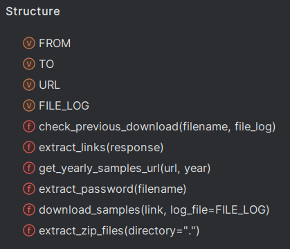

# Malware-traffic downloader

This project aims to download all samples from malware-traffic website
It does it in oneshot, ie without checking for a specific date to download only new samples to avoid scraping all web pages.
**However, downloaded samples names are stored in a logfile, which avoid downloading an already downloaded file.**


### Start the docker

```bash
docker build -t malware_traffic_downloader .
docker run --name malware_traffic_downloader \
    -v "$(pwd)"/../data/:/app/samples \
    -v "$(pwd)":/app/results \
    -d basic_detector
# Replace the actual <mount_point> by a real one like "$(pwd)"/target where are stored samples
```

Volume `data` is for downloaded samples, volume `results` is for the logfile.


### Manual installation

Using pip :
`pip3 install -r requirements.txt`

### How does it work ?

Scrape the website `FIXME` to get all URLs available from the home page for each year.

Then it scrape to these links found to get all links ending in `.zip` to download them.

Once downloaded, each sample is extracted with its password crafted according to malware-traffic's nomenclature in its "About" page



Variables `FROM` and `TO` define years to look for samples on the malware-traffic URL
`URL` is the base URL of the website
`FILE_LOG` is the default name of the file where downloads are logged

Functions are self explanatory :
1) First, `get_yearly_samples_url` is executed to get all links to download zip files
2) For each element of the returned list of links, `download_samples`
   3) Check that the sample has not been already downloaded with `check_previous_download` to download it
   4) If not, use `extract_zip_files` to extract the downloaded sample, with the password from `extract_password`